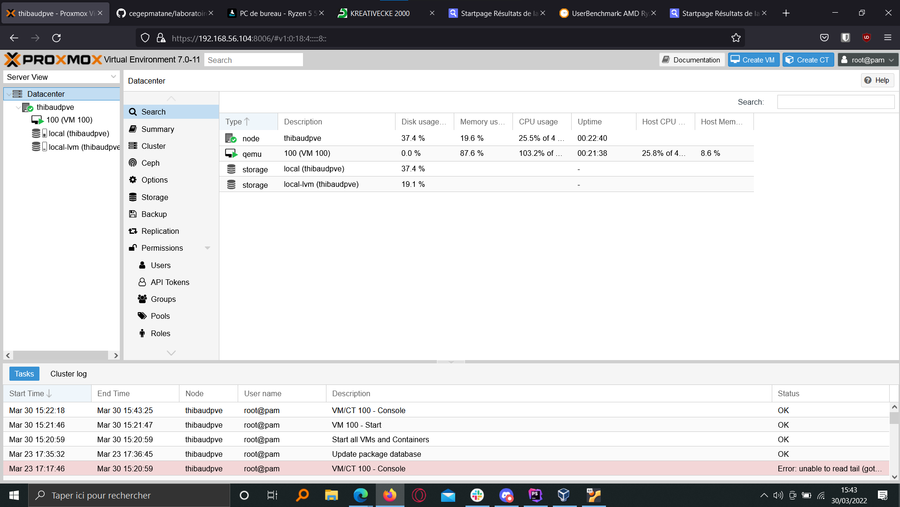
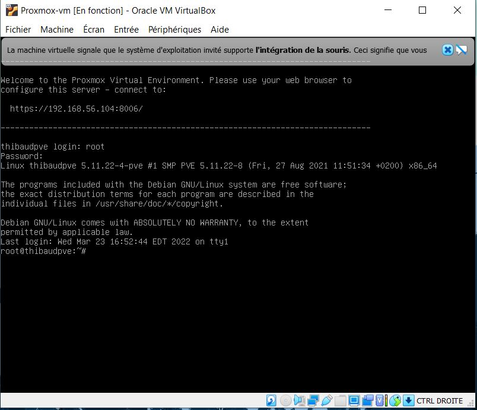
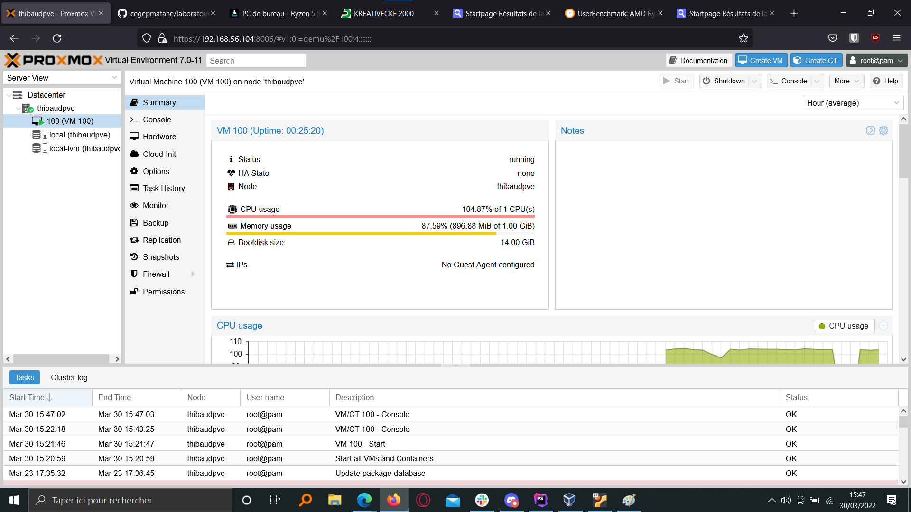
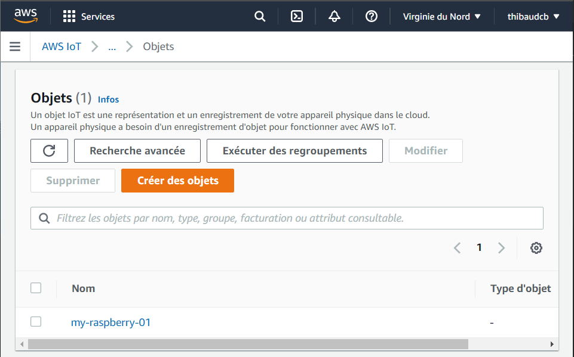
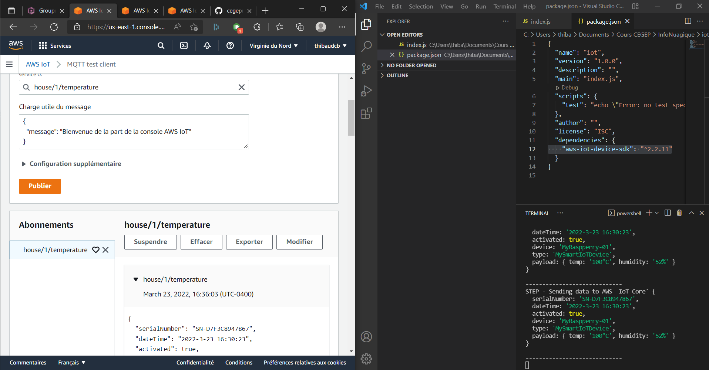
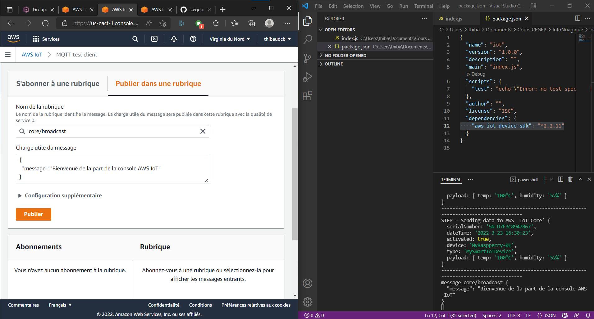

# laboratoires-d-integration-2022-CreatibOfficiel
laboratoires-d-integration-2022-CreatibOfficiel created by GitHub Classroom

### Etudiant : Thibaud Chaussabel Blachier

Installation proxmox VE 
L’interface web est accessible à partir de l’IP statique.

La console VirtualBox

Création d’une machine virtuelle

Image de l'objet :

Image des données :

Image du broadcast :

